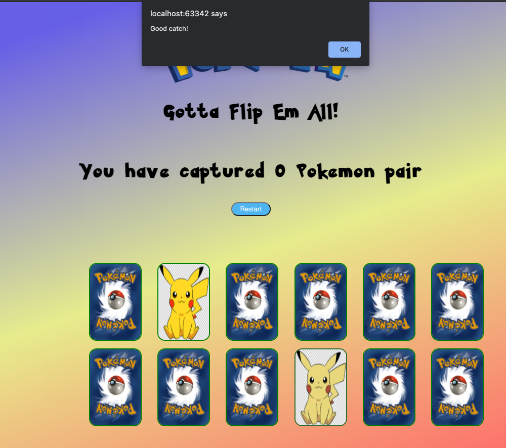

# Gotta Flip em All - Memory card game 
***
A simple concentration memory game with the Pokémon theme.

##The Project
***
This game was a **solo project** created by a **BeCode learner** from the **Junior Web Developer track**
>[Julio Cesar Dias Teixeira](https://github.com/JulioCesarTeixeira)

## Learning Objectives
***
The objective of this project was for it to be a Javascript learning challenge. The specific learning points touched in this game were namely:
- To learn how to manipulate elements in the DOM effectively
  * creating, adding eventListeners, adding attributes, appending, displaying new value/innerText,
- Array manipulation using different methods such as:
  * Loops, push and splice

### Deployment
***
The game is being deployed on GitHub pages, because in that way, it is easy to collaborate.

### The game
***
We had to recreate the concentration memory game. Which basically is a game with cards, and each of them contain an image.
Of each image there are exactly 2 cards that need to be paired up. They are placed face down randomly. The player has to turn two cards in his turn and try to find the corresponding match. If the player succeeds in forming a pair, the images will be replaced by a pokeball, which is positive (in this case)! However, if he fails, both cards will be turned back down.

### Features
***
'Gotta Flip em All' has a set of features, namely:
* The game has 12 cards (6 pairs to be caught)
* They are placed on a random order 
* If you click on a card it will flip up, allowing you to see the image
* when you click on the second card, an alert will pop up telling you if you succeeded or not
* If you succeed, a pokeball image will replace the image of these cards, and you will see an increase in your score on the top of the page
* if you fail, no score will be awarded and the cards will be placed face down
* There is also a restart button, when clicked it will turn all cards face down, re-shuffle them and reset the score.

### Technologies used
***
* Javascript (ES6) mainly;
* HTML5
* CSS3

1. Home page

   
2. Match
   

3. Captured
   
   
4. restart button
   